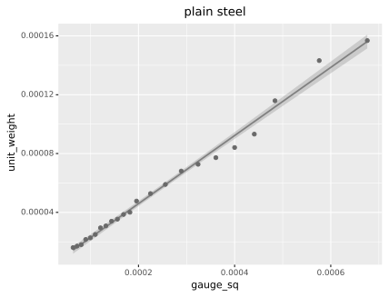
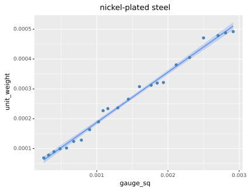
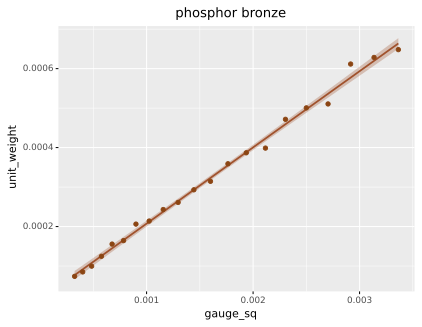
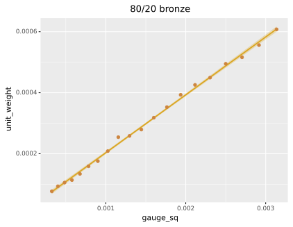
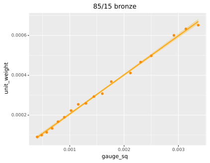
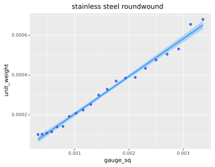
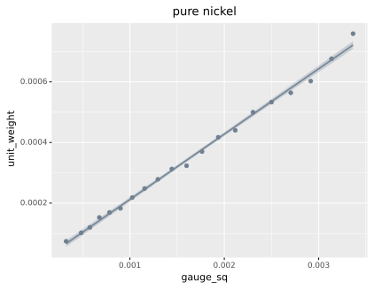
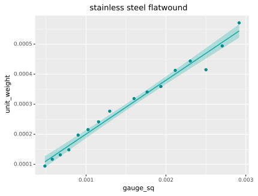

#tenscalc String Material Models

tenscalc estimates string tension for a given material based on published tension guides from one of the largest string manufacturers in the US. I chose the manufacturer was based on 1) the depth of tension guides available for different materials and gauges and 2) upon what I suspect is greater accuracy than another manufacturer's tension guides. A Jupyter notebook of my full analysis of these two large manufacturers is available at `src/tenscalc_modelling.ipynb`. The models of string materials from "Manufacturer D" appear suspiciously linear to me, almost as if the published mass figures underlying the models are based on calculations rather than direct measurements. The mass data from "Manufacturer G" is noisier, appearing more like real-world measures, while still producing estimates with very high goodness-of-fit measures, comparable to those of Manufacturer D.


###Plain Steel


```
      Coef        SE         t    Pr>|t|       R^2
    0.2305    0.0027     85.46       0.0     0.997
```


###Nickel-Plated Steel


```
      Coef        SE         t    Pr>|t|       R^2
    0.1785    0.0022     82.95       0.0    0.9968
```


###Phosphor Bronze


```
      Coef        SE         t    Pr>|t|       R^2
    0.1998    0.0018     109.6       0.0    0.9983
```


###80/20 Bronze


```
      Coef        SE         t    Pr>|t|       R^2
    0.1965    0.0014    139.58       0.0     0.999
```


###85/15 Bronze


```
      Coef        SE         t    Pr>|t|       R^2
    0.2009    0.0016    128.97       0.0     0.999
```


###Stainless Steel Roundwound


```
      Coef        SE         t    Pr>|t|       R^2
    0.1964    0.0026     76.71       0.0    0.9966
```


###Pure Nickel


```
      Coef        SE         t    Pr>|t|       R^2
     0.214    0.0015    141.77       0.0    0.9991
```


###Stainless Steel Flatwound


```
      Coef        SE         t    Pr>|t|       R^2
    0.1903    0.0032     59.25       0.0    0.9957
```

